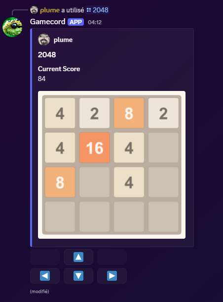
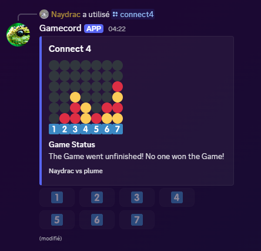
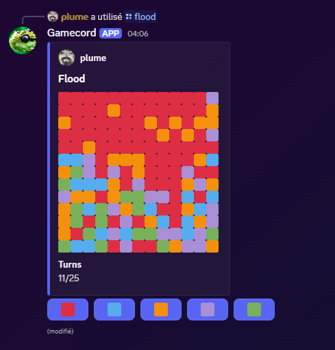
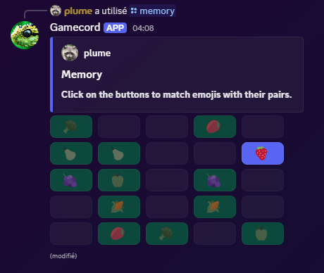
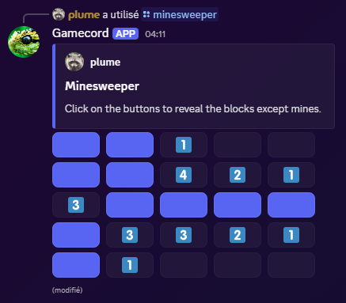
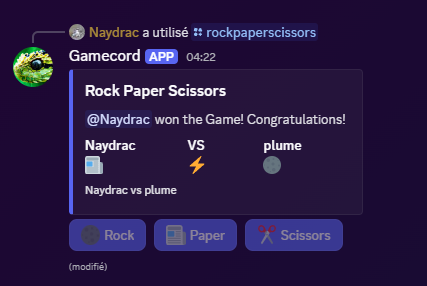
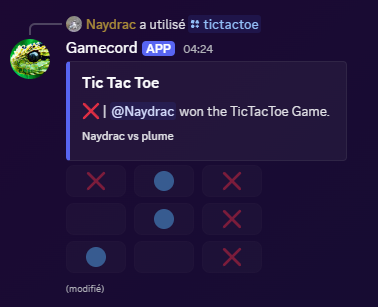
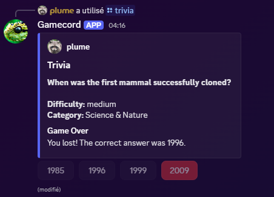
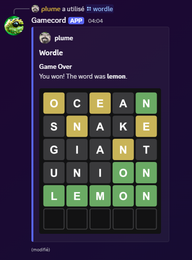

<div align="center">
<br />
    <h1>Gamecord</h1>
    <br />
    <p>
        <a href="https://discord.gg/8PDXWSHH7k"></a>
        <a href="https://www.npmjs.com/package/@sodiumlabs/gamecord"></a>
        <a href="https://www.npmjs.com/package/@sodiumlabs/gamecord"></a>
        <a href="https://github.com/sodium-labs/gamecord/commits/main"></a>
    </p>
</div>

## About

### Gamecord is a collection of games for your Discord bot.

This library was made as a replacement for [discord-gamecord](https://www.npmjs.com/package/discord-gamecord) which is unmaintained (and partially broken) and has no TypeScript support. While the game options are mostly similar, this library offers more features to customize and handle your games. Also, this module does not contain all games from the original.

The module supports both slash commands and message commands!

## Installation

Node.js 18 or newer is required.

```sh
npm install @sodiumlabs/gamecord
```

## Documentation

You can find the docs here: [https://docs.sodiumlabs.xyz/docs/packages/gamecord/stable](https://docs.sodiumlabs.xyz/docs/packages/gamecord/stable)

If you need help, ask on our [support server](https://discord.gg/8PDXWSHH7k).

## Example usage

```js
const { Game2048 } = require("@sodiumlabs/gamecord");

const game = new Game2048(interaction, {
    embed: {
        title: "2048",
        color: 0x5865f2,
    },
    notPlayerMessage: game => `Only ${game.player} can use this menu.`,
    timeout: 60_000,
    emojis: {
        up: "🔼",
        down: "🔽",
        right: "▶️",
        left: "◀️"
    }
});

game.on("error", err => console.error("Error!", err));
game.on("gameOver", result => console.log("Result:", result));

await game.start();
```

## Some previews

Note: every embeds can be fully customized.











## Notes

- The module expects you to pass function that will not error. If they do, the games can break (e.g. by never emitting the `end` or `gameOver` event).
- If you don't use `.on("error")`, errors will emit an `uncaughtException` in your process.
- Every component custom ID starts with `$gamecord-`.
- Most games don't need any permissions since they rely on interaction methods. However, if a game is too long (>= 15 mins), the interaction becomes invalid and the bot will need permission to view the channel and edit its messages.

## Links

- [Documentation](https://docs.sodiumlabs.xyz/docs/packages/gdapi/stable)
- [Discord server](https://discord.gg/8PDXWSHH7k)
- [GitHub](https://github.com/sodium-labs/gamecord)
- [npm](https://npmjs.com/package/@sodiumlabs/gamecord)
- [Sodium Labs](https://sodiumlabs.xyz)

## Help

You need help with the module? Ask on our [support server!](https://discord.gg/8PDXWSHH7k)
